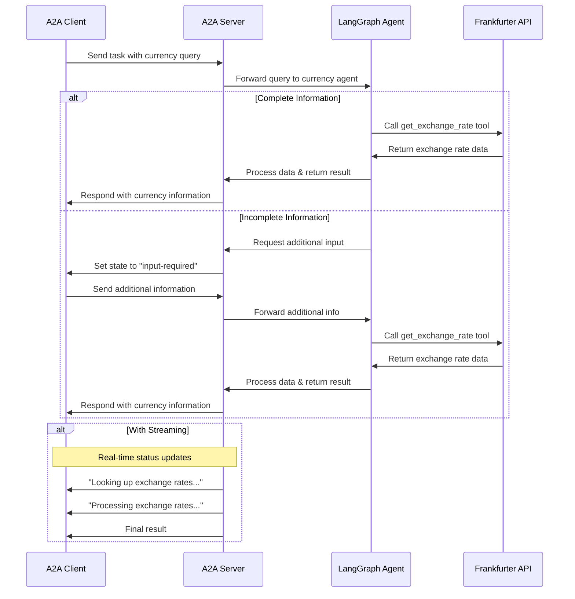

# GlobeXchange

This agent uses LangGraph with LLM (for example Google Gemini..) to provide currency exchange information through a ReAct agent pattern. The A2A protocol enables standardized interaction with the agent, allowing clients to send requests and receive real-time updates.



## Key Features

- **Multi-turn Conversations**: Agent can request additional information when needed
- **Real-time Streaming**: Provides status updates during processing
- **Push Notifications**: Support for webhook-based notifications
- **Conversational Memory**: Maintains context across interactions
- **Currency Exchange Tool**: Integrates with Frankfurter API for real-time rates
## Prerequisites

- Python 3.12 or higher
- [UV](https://docs.astral.sh/uv/)
- Access to an LLM and API Key

## Setup & Running

1. Navigate to the samples directory:

   ```bash
   cd langgraph
   ```

2. Create an environment file with your API key:

   ```bash
   # If you're using a Google Gemini model (gemini-pro, etc.):
   echo "GOOGLE_API_KEY=your_api_key_here" > .env
  
   # If you're using OpenAI or any compatible API (e.g., local LLM via Ollama, LM Studio, etc.):
   echo "API_KEY=your_api_key_here" > .env  # (Not necessary if you have no API key)
   echo "TOOL_LLM_URL=your_llm_url" >> .env
   echo "TOOL_LLM_NAME=your_llm_name" >> .env
   ```

3. Run the agent:

   ```bash
   # Basic run on default port 10000
   uv run app

   # On custom host/port
   uv run app --host 0.0.0.0 --port 8080
   ```

4. In a separate terminal, run the test client:

   ```bash
   uv run app/test_client.py
   ```


